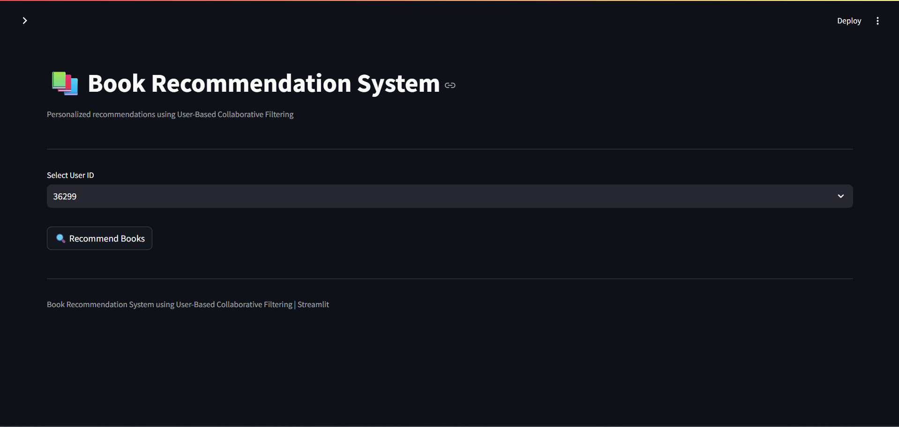
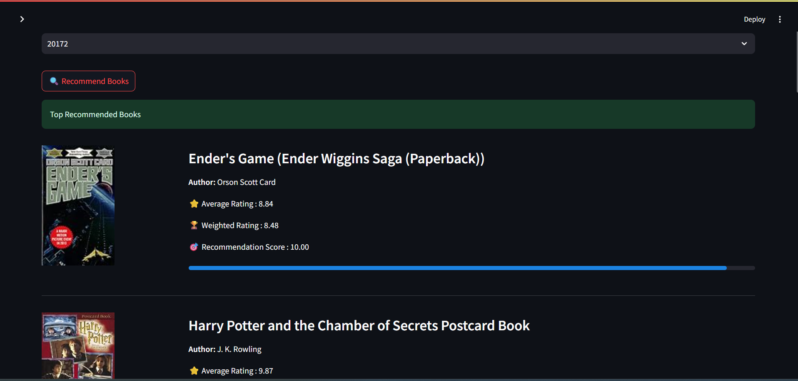

# 📚 Book Recommendation System

An end-to-end book discovery and recommendation platform designed to help users discover books based on their interests and reading preferences.

The project combines data exploration, preprocessing, feature engineering, recommendation logic, and an interactive Streamlit interface to transform raw book-rating data into a user-friendly book discovery experience.

---

## 🎯 Project Objective

Finding relevant books across thousands of titles can be difficult when relying only on popularity or generic search.

This project aims to build a recommendation system that can:

- Analyze book and user-rating data
- Identify meaningful patterns in user preferences
- Process and combine multiple datasets
- Generate personalized or relevant book recommendations
- Present recommendations through a simple interactive interface
- Keep the underlying recommendation logic invisible to the end user

The goal is to move beyond a static list of popular books and create a more useful **book discovery experience**.

---

## 🗂️ Dataset

The project uses book-related datasets collected from Kaggle, including information related to:

- Books
- Users
- Ratings

The datasets contain information such as:

- ISBN
- Book title
- Book author
- Publication year
- Publisher
- User IDs
- Book ratings

Book image links were also handled separately to support the visual presentation of recommendations.

---

## 🔍 Data Preparation & EDA

The raw datasets required substantial preprocessing before they could be used for recommendation modelling.

The project includes:

- Missing-value analysis
- Duplicate analysis
- Data-type inspection
- Identification of invalid or placeholder values
- Age validation and analysis
- Publication-year analysis
- ISBN consistency checks
- User-ID consistency checks
- Dataset merging
- Feature preparation for recommendation modelling

### Data Quality Observations

During exploration:

- ISBN matching between relevant datasets was approximately **87%**
- User IDs showed **100% matching**
- Publication year contained `0` values representing unknown or invalid entries
- Missing book titles and authors were identified and investigated
- User ages were analysed for suspicious values, with values above a reasonable human-age threshold treated as requiring further consideration

These checks were performed before moving toward recommendation modelling to reduce the impact of unreliable records.

---

## 🔗 Dataset Integration

The datasets were integrated using common identifiers.

The book-related datasets were merged primarily using **ISBN**, while user information was connected using **User-ID**.

The merging process was designed to preserve relevant book records while investigating unmatched and missing information rather than silently discarding data.

---

## 🧠 Recommendation System

The recommendation component is being developed around the cleaned and integrated book data.

The system is designed to use information derived from:

- Book metadata
- User interactions
- Ratings
- Book relationships

The recommendation logic is intended to operate behind the interface so that users can interact with the system naturally without needing to understand the underlying machine learning or recommendation techniques.

> **Design principle:** Users should experience a simple book discovery interface while the recommendation pipeline handles the technical processing in the background.

---

## 🖥️ Interactive Application

The project is being developed as an interactive **Streamlit application**.

The intended experience focuses on:

- Simple book discovery
- Search and selection
- Recommendation presentation
- Book cover visualization
- Clean and intuitive interaction

The technical implementation is deliberately kept behind the interface so that the application feels like a book discovery product rather than a machine learning demonstration.

---

## 🖥️ Application Preview

The system provides an interactive Streamlit interface where users can select a User ID and receive personalized book recommendations generated through user-based collaborative filtering.

### Recommendation Interface



### Personalized Recommendations



## 📊 Exploratory Data Analysis

The EDA stage investigates patterns within the book and user datasets, including:

- Distribution of publication years
- Rating behaviour
- User demographics
- Missing values
- Data sparsity
- Book and author availability
- Dataset coverage and matching

Particular attention was given to the sparsity of the rating data, since sparse user-item interactions are an important consideration when building recommendation systems.

---

## 🏗️ Project Workflow

```text
Raw Kaggle Datasets                                                                                 
        │                                                                                           
        ▼                                                                                           
Data Loading & Inspection                                                                           
        │                                                                                           
        ▼                                                                                           
Data Cleaning & Validation                                                                          
        │                                                                                           
        ├── Missing Values                                                                          
        ├── Invalid Values                                                                          
        ├── Duplicate Analysis                                                                      
        └── Data Consistency Checks                                                                 
        │                                                                                           
        ▼                                                                                           
Exploratory Data Analysis                                                                           
        │                                                                                           
        ▼                                                                                           
Dataset Integration                                                                                 
        │                                                                                           
        ├── ISBN Matching                                                                           
        └── User-ID Matching                                                                        
        │                                                                                           
        ▼                                                                                           
Feature Engineering                                                                                 
        │                                                                                           
        ▼                                                                                           
Recommendation Engine                                                                               
        │                                                                                           
        ▼                                                                                           
Streamlit Application                                                                               
        │                                                                                           
        ▼                                                                                           
User-Friendly Book Discovery                                                                        
